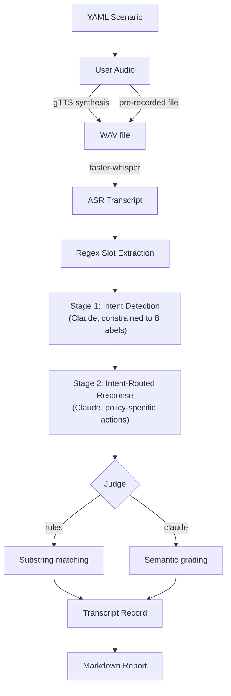

# Voice Intent Eval

[](https://github.com/pjnhek/voice-intent-eval/actions/workflows/ci.yml)

An end-to-end voice pipeline that simulates customer service phone calls, transcribes speech with ASR, detects caller intent via a two-stage Claude LLM flow, and automatically evaluates bot responses against a benchmark of 80 scripted scenarios across 8 intent categories. Supports both synthetic TTS audio and real recorded human speech. The bot is never told what the customer wants — it must figure it out from the conversation alone.

## Table of Contents

- [Results](#results)
- [How It Works](#how-it-works)
- [Benchmark Design](#benchmark-design)
- [Real Audio Mode](#real-audio-mode)
- [Testing](#testing)
- [Getting Started](#getting-started)
- [Extending](#extending)

## Results

Latest evaluation run on 16 scenarios with real recorded audio and the rules judge:

| Metric | Value |
|--------|-------|
| Intent detection accuracy | **100%** (16/16) |
| Scenario pass rate | **94%** (15/16) |
| First-turn intent detection | **100%** — the bot identified the correct intent on turn 1 in every scenario |

Full per-turn breakdown with ASR transcripts, detected intents, and audio file links: [out/report.md](out/report.md)

## How It Works

The system runs as a linear pipeline, orchestrated by a single simulator loop. Each scenario step passes through every stage before moving to the next turn:



### Two-Stage Claude Flow

The core design decision is splitting the bot brain into two LLM calls instead of one:

**Stage 1 — Intent Detection.** The model receives the conversation history, the latest ASR transcript, and any extracted slots. It returns exactly one of 8 predefined intent labels. The output schema uses a strict `enum` constraint, so the model cannot hallucinate a novel intent.

**Stage 2 — Intent-Routed Response.** Once the intent is known, a second call generates the bot's action and utterance. This call receives an intent-specific prompt that includes only the allowed actions and workflow rules for that intent. For example, a "Cancel an order" routing only permits `ASK_ORDER_NUMBER` or `CONFIRM_CANCELLATION` — nothing else.

**Why two stages?** A single broad prompt was strong at intent classification but too loose on workflow execution — it would ask for the wrong slot, add unnecessary follow-up questions, or miss the exact confirmation wording the evaluation judge expects. Splitting the flow keeps the model flexible where it helps most (classification) and constrains it where precision matters (policy execution).

### Intent Routing Policy

Each intent maps to a simple policy: one required slot, one ask action, one final action.

| Intent | Required Slot | Ask Action | Final Action |
|--------|--------------|------------|--------------|
| Cancel an order | `order_number` | `ASK_ORDER_NUMBER` | `CONFIRM_CANCELLATION` |
| Change shipping address | `order_number` | `ASK_ORDER_NUMBER` | `CONFIRM_ADDRESS_CHANGE` |
| Return a damaged item | `order_number` | `ASK_ORDER_NUMBER` | `CONFIRM_RETURN` |
| Check order status | `order_number` | `ASK_ORDER_NUMBER` | `PROVIDE_STATUS` |
| Report a missing package | `order_number` | `ASK_ORDER_NUMBER` | `OPEN_INVESTIGATION` |
| Request refund for duplicate charge | `card_info` | `ASK_CARD_INFO` | `PROCESS_REFUND` |
| Reset account password | `email` | `ASK_EMAIL` | `SEND_RESET_LINK` |
| Upgrade subscription plan | `account_number` | `ASK_ACCOUNT_NUMBER` | `CONFIRM_UPGRADE` |

Once the required slot is present, the bot executes the final action immediately — no unnecessary follow-up questions.

## Benchmark Design

The evaluation suite contains **80 scenarios** across **8 intent categories**, with **10 scenarios per intent**. Each intent includes a mix of caller personalities to test robustness:

| Personality | Description | Count per intent |
|-------------|-------------|-----------------|
| Polite | Straightforward, cooperative callers | 3 |
| Frustrated | Impatient or angry callers | 3 |
| Upfront | Callers who provide key information immediately | 2 |
| Vague | Confused or uncertain callers | 2 |

### Intent Categories

| # | Intent | Example caller utterance |
|---|--------|------------------------|
| 1 | Return a damaged item | "I received a broken blender and I want to send it back." |
| 2 | Request refund for duplicate charge | "I was charged twice for the same order." |
| 3 | Change shipping address | "I need to update the delivery address on my order." |
| 4 | Cancel an order | "I need to cancel my order right now." |
| 5 | Check order status | "Can you tell me where my package is?" |
| 6 | Reset account password | "I can't log in, I need to reset my password." |
| 7 | Report a missing package | "My package was supposed to arrive three days ago." |
| 8 | Upgrade subscription plan | "I'd like to upgrade to the premium plan." |

### How Evaluation Works

The `goal` field in each YAML scenario is **ground truth only** — the bot never sees it. On each turn, the bot returns a `detected_intent`, which is compared against the scenario's `goal`. The framework tracks:

- Whether the bot got the intent right on each turn
- Whether the final turn's intent was correct (the primary metric)
- Which turn the bot first identified the correct intent

Bot responses are evaluated by one of two judges:

- **Rules judge** — deterministic substring matching (e.g., a cancellation response must contain "cancelled" or "canceled")
- **Claude judge** — semantic grading via Claude structured outputs, for cases where exact wording varies but meaning is correct

### Scenario Format

```yaml
id: cancel_order_004
goal: "Cancel an order"
steps:
  - user: "I need to cancel my order right now."
    bot_expect:
      contains_any: ["order number", "order #", "which order"]
  - user: "Order 58463. Just cancel it."
    bot_expect:
      contains_any: ["cancelled", "canceled"]
```

## Real Audio Mode

Use `--real-audio <directory>` to replace synthetic TTS with pre-recorded human speech on a per-turn basis. This tests the full pipeline against real acoustic conditions — background noise, accents, hesitations, and natural speech patterns that TTS cannot replicate.

For each scenario step, the simulator looks for `user_<turn>` files and checks extensions in priority order: `.wav`, `.m4a`, `.mp3`, `.ogg`, `.flac`. If no recording exists for a turn, it falls back to TTS. You can mix real and synthetic audio within a single scenario.

Expected directory layout:

```text
recordings/
  cancel_order_004/
    user_1.m4a
    user_2.m4a
  change_address_006/
    user_1.wav
    user_2.wav
```

Use `--real-audio-only` alongside `--real-audio` to skip scenarios that have no recordings, so you can iterate quickly on just the recorded subset:

```bash
poetry run voice-eval scenarios scenarios/ --real-audio recordings/ --real-audio-only
```

## Testing

The test suite covers all pipeline stages with **10 test modules** and **~1,300 lines of tests**. All external dependencies — Claude API, gTTS, faster-whisper — are fully mocked, so tests run fast with no API keys or network access required.

| Module | What it covers |
|--------|---------------|
| `test_bot_brain.py` | Two-stage Claude flow, intent detection schema, intent-routed response, partial failure fallback |
| `test_simulator.py` | Simulator loop, intent tracking fields, real audio file lookup, `--real-audio-only` filtering |
| `test_evaluator_rules.py` | Deterministic substring matching for all expectation types |
| `test_evaluator_claude.py` | Claude judge structured output parsing |
| `test_bot_tools.py` | Regex-based slot extraction for all slot types |
| `test_cli.py` | CLI wiring and argument passing |
| `test_scenario.py` | YAML scenario loading and validation |
| `test_markdown_report.py` | Report generation, intent accuracy summary, per-turn output |

CI runs automatically on every push and pull request via GitHub Actions.

```bash
poetry run pytest -v
```

## Getting Started

### Prerequisites

- Python 3.11+
- [Poetry](https://python-poetry.org/)
- `ffmpeg` (required by faster-whisper for audio decoding)

### Installation

```bash
poetry install
```

Install ffmpeg:

```bash
# macOS
brew install ffmpeg

# Ubuntu / Debian
sudo apt-get install ffmpeg
```

### Environment Variables

Copy `env.example` to `.env` and set:

| Variable | Required | Default | Description |
|----------|----------|---------|-------------|
| `ANTHROPIC_API_KEY` | Yes | — | Powers the Claude bot brain and the optional Claude judge |
| `DEFAULT_ASR_MODEL` | No | `tiny` | faster-whisper model size (`tiny`, `base`, `small`, etc.) |

### CLI Reference

```bash
# Run all 80 scenarios with the rules judge
poetry run voice-eval scenarios scenarios/

# Use the Claude judge for semantic grading
poetry run voice-eval scenarios scenarios/ --judge claude

# Use a larger ASR model for better transcription
poetry run voice-eval scenarios scenarios/ --model base

# Use pre-recorded audio, falling back to TTS when no recording exists
poetry run voice-eval scenarios scenarios/ --real-audio recordings/

# Only run scenarios that have recordings
poetry run voice-eval scenarios scenarios/ --real-audio recordings/ --real-audio-only

# Custom report and audio output paths
poetry run voice-eval scenarios scenarios/ --report out/report.md --audio-dir out/audio
```

## Extending

To add a new intent (e.g., a 9th conversation flow):

1. **Add regex slot patterns** in `voice_eval/bot_tools.py` if the flow needs new slot types.
2. **Add the intent policy** in `voice_eval/bot_brain.py` — add the intent string to `_VALID_INTENTS`, add an entry to `_INTENT_POLICIES` with the required slot, allowed actions, and response wording guidance.
3. **Add YAML scenarios** under `scenarios/` with the exact ground-truth `goal` string matching the new intent label.

The bot infers intent from the conversation itself — the scenario `goal` is only used for evaluation, never passed to the bot.

## Project Structure

```text
voice_eval/
├── cli.py                 # Typer CLI entry point
├── simulator.py           # Core simulation loop and intent evaluation
├── bot_brain.py           # Two-stage Claude bot (intent detection + routed response)
├── bot_tools.py           # Regex-based slot extraction
├── tool_client.py         # Slot extraction dispatch layer
├── scenario.py            # YAML scenario loader
├── evaluator_rules.py     # Deterministic substring judge
├── evaluator_claude.py    # Claude semantic judge
├── audio/
│   ├── tts.py             # Text-to-speech via gTTS
│   └── asr.py             # Speech-to-text via faster-whisper
└── reporters/
    └── markdown.py        # Markdown report generator

scenarios/                 # 80 YAML scenarios (8 intents × 10 each)
recordings/                # Pre-recorded human audio files
tests/                     # 10 test modules, fully mocked
out/report.md              # Latest evaluation report
```
